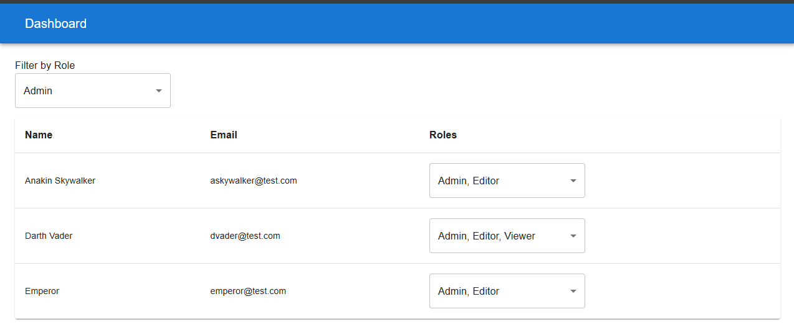

# ControlUp Test Assignment



This repository contains two projects:

- **Server (NestJS + TypeORM + PostgreSQL)** - REST API with Users and Roles
- **Client (Vite + React + MUI)** - Admin dashboard for managing users and roles

---

## Prerequisites

- Node.js >= 18
- npm
- Docker & Docker Compose (for running PostgreSQL locally)

## Project structure

```
├── client
└── server
```

## Setup & Run (Backend)

### 1. Install server dependencies

```bash
cd server
npm install
```

### 2. Run Docker and server script below

```bash
npm run db:up
```

### 3. Wait until database system is ready to accept connections and run for server

```bash
npm start
```

### 4. Install client dependencies and start

```bash
cd client
npm install
npm start
```

## Assumptions and Trade-offs

### Assumptions

- The number of users and roles is relatively small, so pagination was not implemented.
- No authentication or authorization is required, as this is a demo project.
- Only one environment (local) is assumed, without dev/staging/prod separation and moving values to env variables.

### Trade-offs

- No **debouncing** was added for filters or role updates (requests are sent immediately for simplicity).
- No **caching** layer was implemented (in a real project, React Query or RTK Query would be preferable).
- No **validation** for request payloads is done in NestJS (in production, `class-validator` should be used with DTOs).
- Shared **types** were not extracted into a separate package (kept locally in each project).
- Inline styles were used (in a real project, MUI themes customization and SCSS would be preferable).
- For global messages, Context + Snackbar was used instead of Redux/Zustand (sufficient for a small project).
